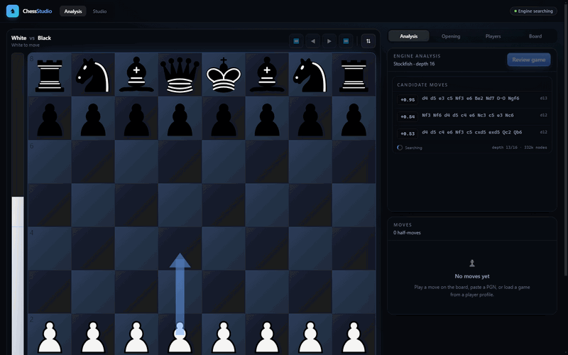
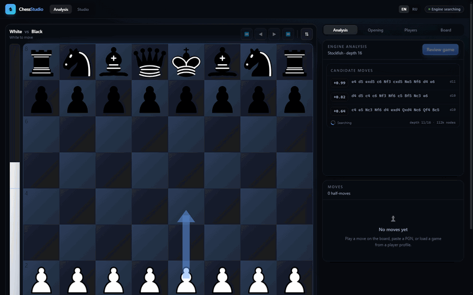
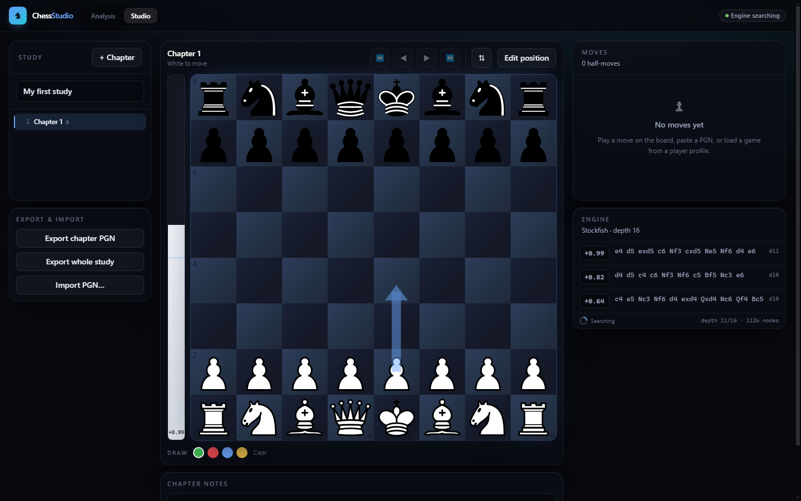
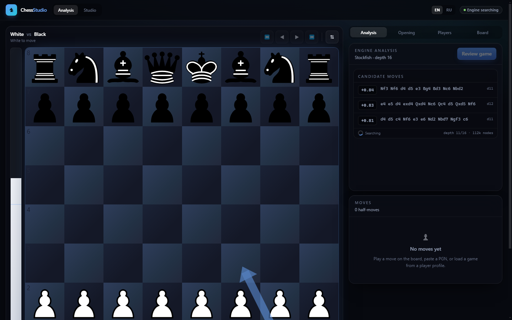
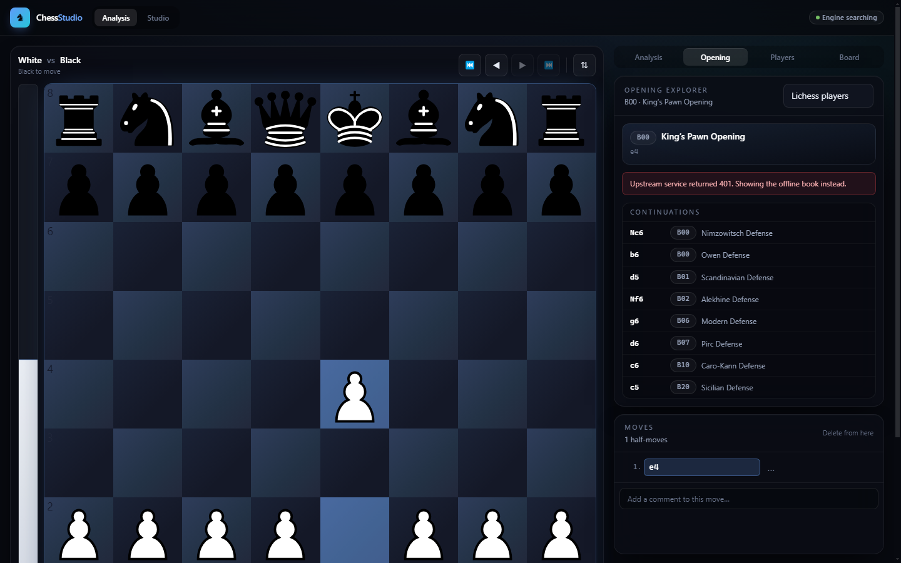

<h1 align="center">♞ Chess Studio</h1>

<p align="center">
  A production-ready chess <b>analysis &amp; training suite</b> for desktop/web — a Stockfish-powered
  analysis board with <b>branching variations</b>, automatic move classification and plain-English
  explanations, cloud-eval&nbsp;+&nbsp;7-piece tablebase, a combined offline&nbsp;+&nbsp;online opening
  explorer, one-click import from Lichess and Chess.com, an offline <b>game library</b> with
  full-text/FEN search, a <b>stats dashboard</b>, an <b>opening repertoire trainer</b> with spaced
  repetition, a <b>tactics trainer built from your own blunders</b>, <b>play vs. Stockfish</b>, and a
  full study/PGN studio with a drag-and-drop position editor.
</p>

<p align="center">
  
  
  
  
  
  
</p>

<p align="center">
  
</p>

<p align="center"><i>Live evaluation, best-move arrows and instant move classification as you play.</i></p>

Built with **Next.js 14 (App Router) · TypeScript · Tailwind CSS · Framer Motion ·
chess.js · react-chessboard · Stockfish 16 NNUE (WebAssembly, in a Web Worker) · IndexedDB**,
and packaged as a native Windows app with **Electron**. It is also an **installable PWA**.

---

## Seven workspaces

| | Workspace | What it's for |
| --- | --- | --- |
| ♟ | **Analysis** | Live engine, **branching variations** (a real move tree), move classification & explanations, one-click full-game review. |
| 📚 | **Studio** | Multi-chapter studies with a drag-and-drop position editor and PGN import/export. |
| 🗄 | **Library** | An offline game database (IndexedDB) with search by player / opening / ECO / date / result / **exact FEN**, and **batch review** of your games. |
| 📊 | **Stats** | A dashboard scoped to any player — win-rate by colour, opening repertoire, review accuracy and a move-quality breakdown — from your library **or fetched live** from Lichess/Chess.com without saving. |
| 🎯 | **Repertoire** | Build White/Black opening repertoires and drill them with a **spaced-repetition trainer**. |
| 🧩 | **Tactics** | A puzzle trainer generated **from your own blunders**. |
| 🤖 | **Play** | Play a full game against Stockfish at an adjustable strength. |

---

## A closer look

<table>
  <tr>
    <td width="50%" valign="top">
      <b>Six board themes, live</b><br>
      
    </td>
    <td width="50%" valign="top">
      <b>Full study &amp; position editor</b><br>
      
    </td>
  </tr>
  <tr>
    <td width="50%" valign="top">
      <b>Analysis board</b><br>
      
    </td>
    <td width="50%" valign="top">
      <b>Opening explorer</b><br>
      
    </td>
  </tr>
</table>

---

## Quick start

```bash
npm install
```

```bash
npm run dev
```

Then open <http://localhost:3000>.

`npm install` runs `scripts/setup-engine.mjs`, which copies the Stockfish WebAssembly build
out of `node_modules` into `public/stockfish/` and writes a `manifest.json` describing it.
The app reads that manifest at runtime and spawns the engine as a classic Web Worker.

Requires **Node.js 18.17+**.

### Other scripts

| Script | What it does |
| --- | --- |
| `npm run dev` | Development server (re-copies the engine first) |
| `npm run build` | Production build |
| `npm start` | Serve the production build |
| `npm run lint` | ESLint (`next/core-web-vitals`) |
| `npm run typecheck` | `tsc --noEmit` over the whole project |
| `npm run electron:dev` | Run the desktop shell against `localhost:3000` (start `npm run dev` first) |
| `npm run dist` | Build the Windows **installer + portable** `.exe` into `dist-electron/` |
| `npm run dist:dir` | Build the unpacked desktop app only (fast, no installer) |

## Desktop app (Windows .exe)

The project doubles as a native Windows desktop app via **Electron**. Because the app
relies on server-side API routes, the desktop build runs Next.js in **standalone**
server mode: Electron spawns that server on a private localhost port (using its own
bundled Node) and loads it in a Chromium window — so the Stockfish worker, the API
proxies and everything else behave exactly as they do in the browser.

```bash
npm run dist
```

This produces, in `dist-electron/`:

- **`ChessStudio-Setup-1.0.0.exe`** — an NSIS installer (Start-menu + desktop shortcut,
  choose install directory, per-user, uninstaller).
- **`ChessStudio-Portable-1.0.0.exe`** — a single double-click executable that needs no
  installation.

`scripts/make-icon.mjs` generates `build-assets/icon.ico`; `scripts/prepare-electron.mjs`
copies the static assets and the Stockfish engine into the standalone server so
electron-builder can ship one self-contained folder. The Electron entry point is
`electron/main.js`.

---

## Project structure

```
chess-studio/
├── next.config.mjs                 # headers for /stockfish, webpack fallbacks
├── tailwind.config.ts              # design tokens, move-quality palette, keyframes
├── tsconfig.json                   # strict TS, "@/*" path alias
├── postcss.config.mjs
├── scripts/
│   └── setup-engine.mjs            # copies a Stockfish build into public/stockfish
├── public/
│   └── stockfish/                  # generated at install time (git-ignored)
└── src/
    ├── app/
    │   ├── layout.tsx              # root layout + <AppShell> + PWA manifest
    │   ├── globals.css             # design system, component classes
    │   ├── page.tsx                # ANALYSIS BOARD (branching variations)
    │   ├── studio/page.tsx         # STUDIO (chapters, editor, PGN)
    │   ├── library/page.tsx        # LIBRARY (IndexedDB games + search + batch review)
    │   ├── stats/page.tsx          # STATS dashboard (+ live online fetch)
    │   ├── repertoire/page.tsx     # REPERTOIRE builder + SRS trainer
    │   ├── tactics/page.tsx        # TACTICS from your blunders
    │   ├── play/page.tsx           # PLAY vs. Stockfish
    │   └── api/
    │       ├── profile/route.ts    # Lichess / Chess.com profile proxy
    │       ├── games/route.ts      # recent games proxy
    │       ├── explorer/route.ts   # Lichess Opening Explorer proxy
    │       ├── cloud-eval/route.ts # Lichess cloud-eval proxy
    │       └── tablebase/route.ts  # Lichess 7-piece tablebase proxy
    ├── components/
    │   ├── AppShell.tsx            # nav, engine status, store hydration
    │   ├── Chessboard.tsx          # BoardSurface: moves, arrows, badges, promotion
    │   ├── AnalysisPanel.tsx       # engine lines + "why this move?" + review
    │   ├── OpeningBook.tsx         # opening name, win rates, continuations
    │   ├── ProfileFetch.tsx        # username/URL → profile → game list
    │   ├── StudioEditor.tsx        # drag-and-drop position editor
    │   ├── MoveList.tsx            # move table with quality badges
    │   ├── MoveQualityBadge.tsx    # animated classification icons
    │   ├── GameReviewSummary.tsx   # accuracy dials, eval graph, counts
    │   ├── EvalBar.tsx
    │   ├── EngineLines.tsx
    │   ├── BoardControls.tsx       # navigation + PGN/FEN import & export
    │   ├── ChapterList.tsx
    │   ├── ThemePicker.tsx         # board themes, piece styles, engine settings
    │   ├── board/
    │   │   ├── ChessboardLib.tsx   # ssr:false dynamic import + local prop types
    │   │   ├── pieces.tsx          # custom piece styles (glyph / neon / outline)
    │   │   └── PromotionOverlay.tsx
    │   └── ui/Primitives.tsx       # Panel, Button, Tabs, Toggle, Select, Slider…
    ├── hooks/
    │   ├── useStockfish.ts         # engine boot + live analysis with cancellation
    │   ├── useGameReview.ts        # full-game review on a dedicated engine
    │   ├── useOpening.ts           # local book + explorer, debounced
    │   ├── useBoardShortcuts.ts
    │   └── useMounted.ts
    ├── lib/
    │   ├── chess/
    │   │   ├── board.ts            # 64-square model, attack maps, SEE, material
    │   │   ├── tactics.ts          # forks, pins, hanging pieces, king safety
    │   │   ├── fen.ts              # parse/build/validate, castling & e.p. helpers
    │   │   ├── line.ts             # linear move line (studio, play)
    │   │   ├── tree.ts             # branching move tree (analysis board)
    │   │   ├── pgn.ts              # linear PGN writer
    │   │   └── treePgn.ts          # variation-aware PGN parse + export
    │   ├── engine/
    │   │   ├── uci.ts              # UCI parsing, win% / accuracy maths
    │   │   ├── StockfishEngine.ts  # worker wrapper with a serialised job queue
    │   │   ├── cloudEval.ts        # Lichess cloud-eval → PositionAnalysis
    │   │   ├── tablebase.ts        # Lichess tablebase → PositionAnalysis
    │   │   └── engineManager.ts    # live / review / opponent engine instances
    │   ├── analysis/               # classify, explain, review
    │   ├── games/
    │   │   ├── gamesDb.ts          # IndexedDB game store + FEN search + review cache
    │   │   ├── stats.ts            # per-player aggregation
    │   │   └── tactics.ts          # blunder → puzzle extraction
    │   ├── repertoire/
    │   │   ├── repertoireDb.ts     # repertoire + SRS store (own IndexedDB db)
    │   │   └── trainer.ts          # card collection, due selection, scheduling
    │   ├── sound/sounds.ts         # Web-Audio move sounds (no asset files)
    │   ├── openings/               # bundled ECO book + lookup
    │   ├── api/                    # Lichess & Chess.com clients + browser wrappers
    │   └── theme/boardThemes.ts
    ├── store/
    │   ├── gameStore.ts            # analysis board state
    │   ├── studioStore.ts          # study + chapters (persisted)
    │   └── settingsStore.ts        # preferences (persisted)
    └── types/index.ts              # every shared type
```

---

## Features

### 1. Analysis board

* Drag or click to move, with a custom promotion picker.
* **Branching variations** — a real move tree. Playing an alternative from an earlier
  move creates a variation instead of overwriting the line; variations nest, render
  inline in the move list, and can be **promoted to the mainline or deleted**. Variations
  round-trip through PGN (`1. e4 e5 (1... c5 2. Nf3) 2. Nf3`).
* **Hybrid evaluation pipeline**: an ≤7-piece **Syzygy tablebase** lookup and the
  **Lichess cloud-eval cache** are tried first for instant, deep results, falling back
  seamlessly to the local engine. A chip shows which source served the position.
* Configurable depth and MultiPV (1–5); animated evaluation bar that flips with the board.
* Best-move arrow, last-move highlight, check indicator, legal-move dots. **Sound effects**
  for moves, captures, checks, blunders and game end (synthesised, no asset files).
* Right-**drag** to draw arrows, right-**click** to highlight squares, in four colours;
  redraw a mark to erase it, or **Clear arrows** for a clean board. Annotations are stored
  per move and exported to PGN as `[%cal]` / `[%csl]`.
* Keyboard navigation: `←` `→` `Home` `End`, `↑` `↓` to switch variations, `F` to flip.

### 2. Move classification & explanations

Every move gets one of ten labels, each with its own **crisp vector icon** (a teal `!!`,
a green ★, a thumbs-up, an open book, `?!`/`?`/`??`, …) in the style of the premium
analyzers — shown as an animated badge on the destination square and in the move list:

| ★ Best | ✦ Great | ✦✦ Brilliant | 👍 Excellent | ✓ Good | 📖 Book | ➔ Forced | ?! Inaccuracy | ? Mistake | ?? Blunder |
| --- | --- | --- | --- | --- | --- | --- | --- | --- | --- |

Classification is driven by the *drop in winning chances* (Lichess' win-probability model)
rather than raw centipawns, so a 0.5-pawn slip in a wild position is judged differently
from the same slip in a dead-drawn one. On top of that:

* **Forced** — only one legal move.
* **Book** — still inside the bundled opening book.
* **Great** — the played move is best *and* the runner-up loses ≥ 10% of winning chances.
* **Brilliant** — a genuine material sacrifice (verified with static exchange evaluation)
  that is still within 15 cp of best and keeps the position healthy.

Explanations are generated from the position, not from templates alone. The explainer
computes attack maps, runs SEE on every square, and detects forks, pins, loose pieces and
king pressure, producing sentences such as:

> **Nxd4 is a blunder because it leaves the knight on d4 undefended, costing 3.2 pawns —
> Qxd4 wins it on the spot.** The engine prefers Bb3, pinning the knight on c6 against the
> king. The evaluation moves from +0.42 to −2.10.

### 3. Full-game review

One click reviews every position. Produces per-side accuracy (blended arithmetic/harmonic
mean, as Lichess does), average centipawn loss, a clickable evaluation graph, and a
breakdown of every classification. A **jump-to-mistakes** stepper walks straight through
the inaccuracies, mistakes and blunders. Reviews are **cached in IndexedDB**, so reopening
a game restores its report instantly instead of re-analysing.

### 4. Opening explorer

* A bundled ECO book (~255 named lines) resolves the opening name instantly and offline.
* The Lichess Opening Explorer is layered on top for full coverage, White/Draw/Black win
  rates, move popularity and notable games. Switch between the **Lichess players** and
  **Masters** databases.
* Click any continuation to play it on the board.

### 5. Lichess & Chess.com import

Type a username or paste a profile URL (`lichess.org/@/…`, `chess.com/member/…`) — the
platform is detected automatically. Profile, ratings and the 20 most recent games are
fetched, and any game loads onto the analysis board in one click.

Both APIs are proxied through this app's own route handlers (`/api/profile`, `/api/games`)
so CORS is a non-issue and the descriptive `User-Agent` that Chess.com requires is always
sent.

### 6. Studio

* Multiple **chapters**, each with its own starting position, move line, orientation and
  notes. Everything is persisted to `localStorage`.
* A **position editor**: drag pieces from the palette onto the board (or arm a brush and
  click), move pieces freely between squares, erase, and control side-to-move, castling
  rights and the en-passant target. FEN is validated live — structural errors and
  "valid but not legal to play from" are reported separately.
* Per-move text commentary and board annotations.
* **Export** a single chapter or the whole study as standard PGN, with comments, NAGs,
  shape annotations and optional `[%eval]` tags. **Import** a PGN containing several games
  to create one chapter per game.

### 7. Appearance & language

Six board themes (Walnut, Marble, Neon Dark, Emerald, Midnight, Coral) and four piece
styles (Classic vector, Glyph, Neon, Outline), plus toggles for coordinates, legal-move
hints, the eval bar, the best-move arrow and classification badges, and sliders for
animation speed, search depth, MultiPV, review depth and hash size.

The entire interface is **bilingual — English and Russian (Русский)** — switchable from the
`EN / RU` toggle in the header (or the Board settings tab), including every panel, control,
and the move-classification names (Бриллиантовый, Замечательный, Лучший, …). The choice is
remembered per browser.

### 8. Game library (offline, IndexedDB)

* Store **thousands of games locally** in the browser via a dependency-free IndexedDB
  layer — no server, fully offline.
* **Rich search**: by player, opening name, ECO prefix, date range, result, source, and an
  **exact-FEN "which of my games reached this position?"** lookup (backed by a multiEntry
  position index). Save games from a player profile (one or all) or by importing PGN files.
* **Batch review**: one click reviews every un-reviewed game on the shared engine, caching
  each report and stamping the game with its accuracy — which then feeds the stats
  dashboard and the tactics trainer.

### 9. Stats dashboard

* A dashboard that **scopes to a single player**: games, decisive/draw split, score and
  win-rate **by colour**, most-played and best/worst-scoring openings, opposition strength,
  games per year, and — for reviewed games — **review accuracy and a full move-quality
  breakdown** (how many Brilliants, Bests, Mistakes, Blunders…).
* Works on your **library**, or **fetches a player's games live** from Lichess/Chess.com and
  computes everything in memory — **without importing anything**.

### 10. Repertoire trainer (spaced repetition)

* Build **White and Black opening repertoires** as branching trees (play moves or import
  PGN; each opponent reply you prepare becomes a variation). Stored in their own IndexedDB
  database.
* A **spaced-repetition trainer** plays the opponent's moves and quizzes you on your reply.
  A wrong move is flagged and the correct one shown; each position is scheduled with a
  Leitner box system, and the trainer steers opponent moves toward positions that are due.
  Per-session correct/missed/accuracy and per-repertoire due counts are tracked.

### 11. Tactics trainer — from your own blunders

Mines every stored game review for mistakes and blunders that have a known best move and
turns each into a "find the engine's move" puzzle. Wrong tries prompt a retry, **Reveal**
shows the answer with an arrow, **Hint** highlights the piece, and it tracks
solved / revealed / streak. The more games you review, the richer this gets.

### 12. Play vs. Stockfish

Play a full game against the engine at an adjustable **strength** (Skill Level), as White,
Black or a random side. Resign, or send the finished game straight to the analysis board.

### 13. Installable PWA

A web-app manifest and icon make Chess Studio **installable** (its own window, offline the
usual browser way). *(A caching service worker is intentionally omitted — a controlling
service worker breaks the threaded engine's `SharedArrayBuffer` cross-origin isolation, and
the engine comes first.)*

---

## Engine notes

* The app runs **Stockfish 16 with NNUE** (the `stockfish` package). The pages are served
  **cross-origin isolated** (`COOP: same-origin` + `COEP: credentialless`), so
  `SharedArrayBuffer` is available and the engine runs the **multi-threaded** build, using
  most of the machine's cores — dramatically faster and stronger than a classical engine.
  `credentialless` (rather than `require-corp`) keeps cross-origin images such as Chess.com
  avatars loading. When isolation is unavailable, `StockfishEngine` transparently falls back
  to the single-threaded NNUE build.
* The ~40 MB NNUE net (`nn-*.nnue`) is loaded once at startup (cached afterwards / bundled
  in the desktop app), which is what makes the evaluation accurate.
* Searches are serialised through a job queue. Starting a new search sends `stop` to the
  engine, so the board never lags behind the cursor; stale results are discarded by token.
* The transposition table is intentionally **not** cleared between positions in a review —
  that alone makes a full-game pass several times faster.
* **Cloud eval & tablebase first.** For live analysis the app queries the Lichess
  cloud-eval cache (and, for ≤7-piece endgames, the Syzygy tablebase) before spinning up a
  local search — instant, very deep results when available, with a transparent fallback to
  the local engine. Cloud/tablebase scores are normalised to the app's white-POV convention.

### Swapping in a different Stockfish build

`scripts/setup-engine.mjs` harvests the `stockfish` package, copies every build + the NNUE
net into `public/stockfish/`, and writes a `manifest.json` naming the `single` and
`threaded` entry points. To change engine version:

```bash
npm install stockfish@<version>
```

Re-run `node scripts/setup-engine.mjs`.

If `public/stockfish/` is missing or empty, the app does not crash: the header shows
"Engine unavailable" with a **Retry** button, and every non-engine feature keeps working.

---

## Third-party services

| Service | Used for | Docs |
| --- | --- | --- |
| Lichess API | Profiles, recent games | <https://lichess.org/api> |
| Lichess Opening Explorer | Opening statistics | <https://explorer.lichess.ovh> |
| Lichess Cloud Eval | Instant deep evaluations | <https://lichess.org/api#tag/Analysis> |
| Lichess Tablebase | 7-piece endgame results | <https://tablebase.lichess.ovh> |
| Chess.com Published-Data API | Profiles, stats, monthly archives | <https://www.chess.com/news/view/published-data-api> |

All three are public and unauthenticated. Please respect their rate limits.

---

## License

MIT.
